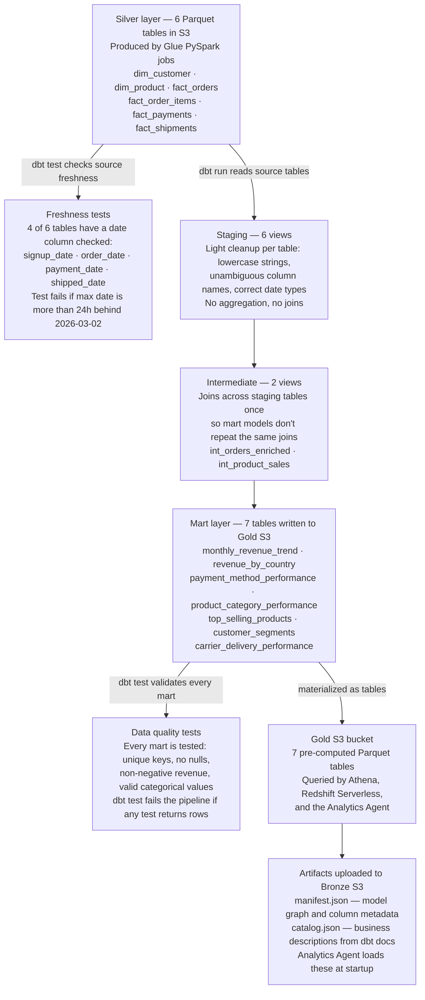
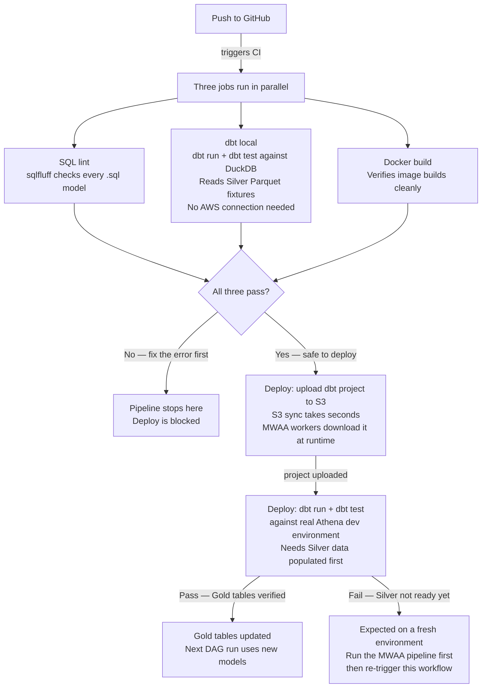

# platform-dbt-analytics

This repository is part of the [Enterprise Data Platform](https://github.com/enterprise-data-platform-emeka/platform-docs). For the full project overview, architecture diagram, and build order, start there.

**Previous:** [platform-glue-jobs](https://github.com/enterprise-data-platform-emeka/platform-glue-jobs): those PySpark jobs reconciled Bronze CDC records into the clean Silver star schema that dbt reads here.

---

## What this repository does

These are the dbt (data build tool) models that transform the Silver star schema into the Gold analytics layer. dbt runs SQL against Amazon Athena, which queries Parquet files in S3 (Simple Storage Service) directly using the Glue Catalog as its metadata store.

The Silver layer contains clean, validated fact and dimension tables produced by the Glue PySpark jobs. This layer reads those tables and produces seven aggregation models that each answer a specific business question. dbt handles the SQL transformation, schema management, and data quality testing.

---

## Why dbt for this layer

Silver already has clean, modelled data. Gold is pure aggregation: counts, sums, averages, and groupings. SQL is the right tool for that. dbt adds three things on top of plain SQL: a build system that resolves dependencies between models and runs them in the right order, a testing framework that validates the output of every model, and documentation generation.

Using Athena as the query engine means no data loading step. Athena reads Parquet directly from S3, so dbt just runs SQL and the results land back in S3 as new Parquet files in the Gold bucket.

---

## The 15 models

Models are organized into three layers that build on each other.

### Staging (6 views)

Staging models are views. They sit directly on top of Silver and do light cleanup: lowercase strings for consistency, rename columns where the source name is ambiguous, cast dates to the correct type. No aggregation happens here.

| Model | What it does |
|---|---|
| `stg_customers` | Lowercases `country`, casts `signup_date` to date |
| `stg_products` | Renames `name` to `product_name` for clarity |
| `stg_orders` | Light pass-through with partition columns |
| `stg_order_items` | Line items with partition columns |
| `stg_payments` | Renames `method` to `payment_method`, `status` to `payment_status` |
| `stg_shipments` | Delivery tracking records |

### Intermediate (2 views)

Intermediate models join related staging models together so the mart models don't have to repeat the same joins.

| Model | What it does |
|---|---|
| `int_orders_enriched` | Joins orders with customer, payment, and shipment context into one row per order |
| `int_product_sales` | Joins order line items with product catalogue |

### Marts (7 tables)

Mart models are the final output. They are materialized as tables (persisted Parquet in S3 Gold) rather than views so BI (Business Intelligence) tools can query them without re-running the aggregation SQL each time.

**Finance:**

| Model | Business question |
|---|---|
| `monthly_revenue_trend` | How is revenue trending month by month? |
| `revenue_by_country` | Which countries drive the most revenue? |
| `payment_method_performance` | How are different payment methods performing? |

**Product:**

| Model | Business question |
|---|---|
| `product_category_performance` | Which product categories drive the most sales? |
| `top_selling_products` | Which specific products are selling best? |

**Customer:**

| Model | Business question |
|---|---|
| `customer_segments` | How are customers segmented by value and behaviour? |

**Operations:**

| Model | Business question |
|---|---|
| `carrier_delivery_performance` | How is each carrier performing on delivery? |

---

## Data quality tests

Every model has dbt tests defined in YAML. Staging models test that primary keys are unique and not null, that foreign keys reference valid rows in related tables, and that categorical columns only contain known values (for example, `order_status` can only be `pending`, `confirmed`, `shipped`, `delivered`, or `cancelled`). Mart models test that aggregation outputs are not null and that revenue figures are non-negative.

Running `dbt test` after `dbt run` validates every model. If any test fails, the pipeline stops and the failure is logged.

### Data freshness tests

Four Silver source tables have a custom freshness test defined in `models/staging/_sources.yml`. The test checks that the latest business date in each table is within 24 hours of `2026-03-02 23:59:59` — the last date present in the Bronze dataset.

| Table | Column checked | Why this column |
|---|---|---|
| `customers` | `signup_date` | Latest customer signed up around March 2nd |
| `orders` | `order_date` | Latest order placed around March 2nd |
| `payments` | `payment_date` | Latest payment processed around March 2nd |
| `shipments` | `shipped_date` | Latest shipment dispatched around March 2nd |

`dim_product` and `fact_order_items` are excluded because the Glue Silver jobs drop `updated_at` and neither table retains a timestamp column after the transformation.

The test uses a custom macro at `macros/test_freshness_relative_to_reference.sql` rather than dbt's built-in `source freshness` command. The built-in command compares against wall-clock time (`now()`), which would always fail for a historical dataset ending in March 2026. The custom macro compares against the fixed reference date instead, so it stays valid permanently.

```bash
# Run freshness tests only
dbt test --select source:silver

# Run all tests (freshness included)
dbt test
```

The freshness tests run automatically in CI and in the deploy workflow's `dbt test` step. A failure means the Silver data did not reach the expected cutoff — either the Glue pipeline was incomplete or the Bronze data was missing records.

---

## Local development with DuckDB

The full dbt project runs locally against DuckDB without any AWS credentials. DuckDB reads the same Parquet files that Silver produces, so the SQL logic can be developed and tested entirely on a laptop.

```bash
# First time setup
make setup

# Run all models locally against DuckDB
make run-local

# Run tests locally
make test-local

# Generate and serve dbt documentation at http://localhost:8080
make docs-local

# Open an interactive DuckDB shell to query the models
make query
```

Local runs write output to `/tmp/edp_analytics.duckdb`. The DuckDB target in `profiles.yml` points Silver source tables at local Parquet files in `data/silver/` rather than the Glue Catalog.

---

## Running against AWS Athena

When running against AWS the dbt profile switches to Athena.

 The Glue Catalog provides the Silver source tables, and Gold models write Parquet back to the Gold S3 bucket.

```bash
# Run all models against AWS dev
make deploy ENV=dev

# Run tests against AWS dev
make test-aws ENV=dev

# Run a specific model only
make run-model MODEL=monthly_revenue_trend ENV=dev
```

The Athena target in `profiles.yml` reads the following environment variables:

| Variable | What it controls |
|---|---|
| `DBT_TARGET` | Which profile target to use (dev / staging / prod) |
| `ATHENA_RESULTS_BUCKET` | S3 bucket for Athena query results |
| `ATHENA_WORKGROUP` | Athena workgroup to use |
| `DBT_ATHENA_SCHEMA` | Output schema name in the Glue Catalog |

---

## Repository structure

```
platform-dbt-analytics/
├── models/
│   ├── staging/
│   │   ├── _sources.yml          ← Silver source definitions
│   │   ├── _staging.yml          ← staging model tests and docs
│   │   ├── stg_customers.sql
│   │   ├── stg_products.sql
│   │   ├── stg_orders.sql
│   │   ├── stg_order_items.sql
│   │   ├── stg_payments.sql
│   │   └── stg_shipments.sql
│   ├── intermediate/
│   │   ├── _intermediate.yml
│   │   ├── int_orders_enriched.sql
│   │   └── int_product_sales.sql
│   └── marts/
│       ├── finance/
│       │   ├── _finance.yml
│       │   ├── monthly_revenue_trend.sql
│       │   ├── revenue_by_country.sql
│       │   └── payment_method_performance.sql
│       ├── product/
│       │   ├── _product.yml
│       │   ├── product_category_performance.sql
│       │   └── top_selling_products.sql
│       ├── customer/
│       │   ├── _customer.yml
│       │   └── customer_segments.sql
│       └── operations/
│           ├── _operations.yml
│           └── carrier_delivery_performance.sql
├── macros/
│   ├── generate_schema_name.sql  ← overrides dbt schema naming for Athena
│   ├── safe_divide.sql           ← null-safe division helper used by marts
│   └── test_freshness_relative_to_reference.sql  ← custom freshness test
├── profiles/
│   └── profiles.yml              ← DuckDB (local) and Athena (AWS) targets
├── dbt_project.yml
├── Dockerfile
├── docker-compose.yml
├── Makefile
└── requirements.txt
```

---

## Materialization strategy

Staging and intermediate models are views. They cost nothing to store and always reflect the latest Silver data without needing to be rebuilt. Mart models are tables. They are rebuilt on every `dbt run`, which replaces the previous version atomically.

The reason mart models are tables rather than views: BI tools running analyst queries would re-execute the aggregation SQL on every dashboard refresh if marts were views. Pre-computing them as tables means the dashboard query hits a simple Parquet read rather than a full aggregation.

---

## How everything fits together

This diagram shows the full picture from raw Silver data to the final Gold tables and monitoring. It's written for someone new to dbt who wants to understand what happens when `dbt run` and `dbt test` are called.



**Why views for staging and intermediate, tables for marts?**
Views are free to store and always reflect the latest Silver data automatically. Marts are pre-computed as tables because BI tools and the Analytics Agent would otherwise re-run the full aggregation SQL on every query. The mart SQL runs once per pipeline execution and the result sits in S3 ready to scan.

**What happens when a test fails?**
`dbt test` returns a non-zero exit code. In the MWAA DAG, the `gold_dbt_test` task fails, which means `upload_dbt_artifacts` and `pipeline_complete` never run. The Analytics Agent keeps using the previous Gold tables from the last successful run.

---

## CI/CD

CI skips runs triggered by README or fixture data changes. Only source code changes (`models/`, `macros/`, `tests/`, `profiles/`, config files) trigger the pipeline.

### On every pull request and push to main

Three jobs run in parallel:

| Job | What it checks |
|---|---|
| SQL lint | sqlfluff lints all `.sql` files in `models/` using the Jinja templater (no AWS connection needed) |
| dbt local | dbt deps + run + test + docs against DuckDB using Parquet fixtures from `data/silver/`. Catches SQL errors, schema mismatches, and test failures before any code reaches Athena. |
| Docker build | Verifies the Dockerfile builds cleanly (no push in CI) |

### On merge to main

The deploy workflow triggers automatically after CI passes. It runs two jobs in sequence.

**Job 1: upload-dbt-to-s3** — syncs the dbt project to `s3://{mwaa-bucket}/dbt/platform-dbt-analytics/` using `aws s3 sync`. This takes seconds. No MWAA environment update is triggered. MWAA workers download the project from this S3 path at the start of every `gold_dbt_run` task, so dbt model changes take effect on the next DAG run with no wait.

**Job 2: run-dbt** — runs `dbt deps`, `dbt run`, and `dbt test` against the dev Athena environment. This validates models against real Silver data as a second check after DuckDB CI. On a fresh environment (Silver tables not yet populated by MWAA), this job fails. That is expected: the MWAA pipeline must run first to populate Silver, then re-trigger this workflow manually. Authentication uses OIDC (OpenID Connect), no long-lived AWS credentials are stored anywhere. dbt artifacts (`manifest.json`, `run_results.json`, `catalog.json`) are uploaded as GitHub Actions artifacts and retained for 30 days.

The dbt project is **not** in plugins.zip. plugins.zip is a permanent empty placeholder created by Terraform and never updated. MWAA environment updates are only triggered by changes to `requirements.txt` in the `platform-orchestration-mwaa-airflow` repo.

### Promotion to staging and prod

Trigger the Deploy workflow manually from GitHub Actions, choose the target environment. GitHub Environment protection rules require reviewer approval for staging and prod before the job runs.

### Not implemented: state:modified + defer

A common CI optimisation for larger dbt projects is `--select state:modified+` combined with `--defer`. The idea: instead of running the full project on every PR, compare the current `manifest.json` against the last successful run's manifest and build only models that changed, plus everything downstream of them. `--defer` lets unchanged upstream models be satisfied from the production results rather than being rebuilt.

I decided not to implement this for two reasons:

**The DuckDB CI target makes it moot.** `--defer` tells dbt to query unchanged upstream models from a production environment. On the DuckDB local target there is no production environment: CI reads from `data/silver/` fixture files. Deferring to "production" in that context has no meaning, and the DuckDB runs are already fast (seconds at zero cost), so `state:modified+` would save little.

**The cold-start problem requires a fallback.** `state:modified` fails if there is no previous manifest to compare against. This happens on the first-ever run, on a new branch with no CI history, and after the artifact retention period expires (7 days for CI artifacts, 30 days for deploy artifacts). A robust implementation needs a step that downloads the previous manifest and falls back to a full run if it does not exist. That is more complexity than the saving justifies at this project's scale.

When to add this: if the number of Gold mart models grows to the point where the Athena deploy run (Job 2) becomes slow or expensive, `state:modified+` on the `dbt run` in the deploy workflow is the right optimisation. The DuckDB CI job does not need it. At that point, download the `manifest.json` from the last successful deploy run and pass it as `--state ./prod-manifest`. Keep a full-run fallback for the cold-start case.

---

## How the tests work

dbt has its own built-in testing system so there is no pytest here. Tests are defined in YAML files next to the models and run with `dbt test`.

**Schema tests** enforce data quality rules. For example: every `customer_id` must be unique and never null, and `payment_method` must be one of `credit_card`, `debit_card`, `paypal`, `apple_pay`, or `crypto`. If an unexpected value appears in the data, the test fails and the pipeline stops.

**CI uses DuckDB instead of Athena.** DuckDB is a lightweight database that runs directly on the GitHub Actions machine with no cloud connection. It reads the Silver Parquet fixtures from `data/silver/` and runs all the dbt models against them. CI finishes in seconds at zero cost. The fixtures are Parquet, not CSV, because Parquet preserves column types exactly, the same types the Gold Athena tables use in production.

The full Athena validation happens in the deploy workflow, where `dbt run` and `dbt test` run against real Silver data in the dev environment. This is the final gate before the Gold tables are updated.



The deploy step failing on a fresh environment is intentional. Silver tables must be populated by the MWAA pipeline before dbt can run against real data. Once the pipeline has run once, this step always passes.

---

**Next:** [platform-orchestration-mwaa-airflow](https://github.com/enterprise-data-platform-emeka/platform-orchestration-mwaa-airflow): with the individual Glue jobs and dbt models defined, the Airflow DAG on MWAA ties them together into an orchestrated end-to-end pipeline that runs on a schedule.
